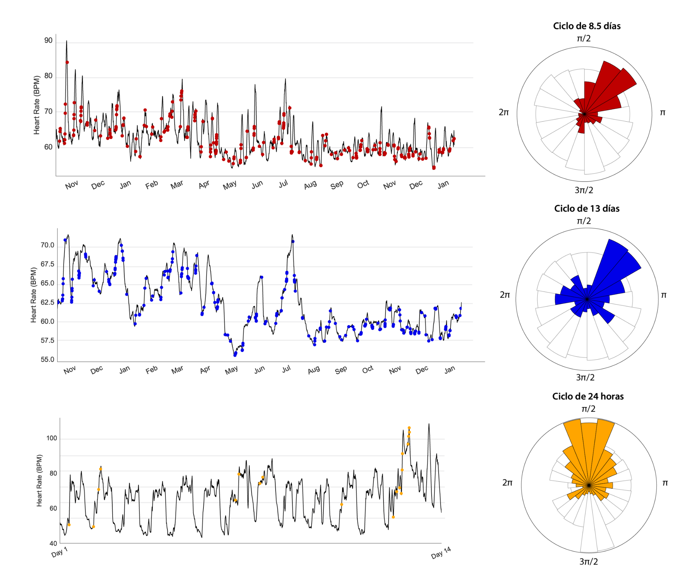

# UnderstandingSeizures

⚠️ ⚠️  Repositoy in progress ⚠️ ⚠️ 

**Abstract**. Our project is an attempt to understand epileptic seizures by answering any researcher's questions about a phenomenon: why, where and when using Python. In order to answer these questions, we first analyzed the EEG data of patients from the CHB-MIT database. After making typographic maps of the electrodes over time, we were able to identify the seizure onset zone in the interictal and ictal periods. Indicating that epilepsies arise from an organized interaction in the brain and are interconnected. We then used ECG data from other research on epilepsy patients to reconstruct their biological clocks based on their heart rate cycles and then test for similarity with epileptic cycles. We identified that epilepsies are related to the cardiac cycles of patients, since after all they affect the autonomic nervous system. Finally, two block diagrams were designed for a monitoring system in clinics (EEG, ECG) and a portable one that would be a smartwatch. For this last part, accelerometer data was extracted, created an app with swift and java and connected to a server on the web. It was demonstrated how using the signals collected and various classification methods could detect epileptic episodes.

    

### **Seizures are likely due to synchronization and aberrant activities of the interconnected brain network**

The need to accurately identify the seizure initiation zone in the field of surgery to remove these areas has aroused great interest in their characterization, as well as the mechanisms of seizure initiation and propagation. Epileptic network mapping shows promise and as a useful tool to understand these processes. It can also help identify tissues that need to be removed during surgery to prevent seizures while doing as little damage as possible to normal brain function.

  

**Figure 1. Topographic analysis of EEG activity in 3 patients during the interictal periods of seizures. For the topographic reconstruction of the EEG signals, the international 10-20 electrode system was used** What is observed in the image is the estimation of the spectral power by welch. The seizure onset zone is located in the front part of the brain.

  

**Figure 1. Topographic analysis of EEG activity in 3 patients during the ictal periods of seizures. For the topographic reconstruction of the EEG signals, the international 10-20 electrode system was used** What is observed in the image is the estimation of the spectral power by welch. The seizure onset zone is located in the central part of the brain.

   

### **Seizures have been found to have circadian, weekly and monthly rhythms**

Thanks to the observation of seizure patterns of different individuals, it is known that epilepsy has circadian rhythms. Chronic electroencephalography (EEG) investigations have revealed that seizure onset is governed by individual-specific multi-day and circadian cycles of epileptic activity and brain excitability in humans and other mammals. It is important to note that multi-day cycles in epilepsy exist for most people and appear to be unconnected to external cues (day of the week, lunar cycle, calendar), are equally common in men and women, and are seen in all epilepsy syndromes and types of seizures. In recent years, research and clinical therapy for epilepsy has focused on brain-heart dynamics. Epileptic seizures can cause functional changes in the autonomic nervous system, often identified as sudden changes in heart rate (tachycardia, bradycardia), near the onset or end of the seizures. In order to understand these changes, we decided to investigate the heart rate cycles and the occurrence of epilepsy throughout these cycles.

  

**Figure 3. Rhythms of the epilepsy cycles along the heart rate cycles in weekly, biweekly and circadian periods.** The results show in three patients that epileptic episodes have a certain correlation with the identified heart rate cycles.

 

### **Detection and prediction of seizures using EGG signals**

 

**Methods.**
For the design of a device that is capable of monitoring patients in a clinic, the CHB-MIT database was used. After filtering the EEG data with a 40 Hz low-pass FIR filter, feature engineering was used to obtain characteristics that would allow us to classify the data. The spectral density was estimated by welch and in a dataframe the power measurements were added in the delta (0.1 - 4 Hz), theta (4 - 8 Hz), alpha (8 - 12 Hz), beta (12 - 30 Hz) bands. ), and gamma (30 - 70 Hz). Additionally, the continuous wave transform was applied and the energy of the logarithmic sum of the subband coefficients was used, the average power of the wave coefficients in each subband, the average of the absolute values ​​of the coefficients in each subband, the deviation standard of the coefficients in each sub-band, and the ratio of the absolute mean values ​​of the adjacent sub-bands. Two randomly chosen power ratios between the C1 and C4 wave coefficient were used. Different classification methods were used, including logistic regression (LR), support vector machine (SVM), classification and regression tree (CART), K-Nearest Neighbors (KNN) and a multilayer multiperceptron (MLP). Finally, MLP was used to classify the EEG signals, not for their identification over time, but to see if they had some type of dependency according to their location.

  

**Figure 4. Classification using unsupervised and supervised clustering methods.**   

### **Detection and prediction of seizures using accelerometer data**

 

**Methods.** For the implementation of the portable device for the detection of epilepsy episodes, we created an app using Swift in XCode 14 using the CoreMotion package. Acceleration was recorded on the X, Y, Z axis with a frequency of 20 Hz. We recorded a total of 10 seconds for the activities of “walking”, “running”, “cutting” and simulated “epileptic” moments. We repeated the recordings four times per activity. Subsequently, for each window of 10 samples, we obtained characteristics in the time and frequency domains. Finally, we used different classification methods that included logistic regression (LR), support vector machine (SVM), classification and regression tree (CART), K-Nearest Neighbors (KNN) and a multilayer multiperceptron (MLP).

  

**Different methods applied for the classification of epileptic episodes using a smartphone.** The data is almost impossible to classify with the naked eye using the accelerometer data in the X, Y or Z axis. However, the use of classification methods can facilitate this process, especially the use of multilayer perceptron.
  
  

### References 
[1]	NIH. «Epilepsia», Accedido: 29 de noviembre de 2022. [En línea]. Disponible en: https://medlineplus.gov/spanish/epilepsy.html

[2] Ministerio de la Mujer y Poblaciones Vulnerables - MIMP. Consejo Nacional para la Integración de la Persona con Discapacidad. «El 75% de las personas que tienen epilepsia no acuden a los establecimientos de salud para recibir tratamiento médico adecuado». Accedido: 29 de noviembre de 2022. [En línea]. Disponible en: https://www.gob.pe/institucion/conadis/noticias/342373-el-75-de-las-personas-que-tienen-epilepsia-no-acuden-a-los-establecimientos-de-salud-para-recibir-tratamiento-medico-adecuado

[3]	INCN. «Epilepsia», Accedido: 29 de noviembre de 2022. [En línea]. Disponible en: https://www.incn.gob.pe/servicios/neurologia/epilepsia/

[4]	P. Gujarati. «What is Accelerometer and how does it work on smartphones», Accedido: 29 de noviembre de 2022. [En línea]. Disponible en: https://www.techulator.com/resources/8930-How-does-smart-phone-accelerometer-work.aspx

[5]	https://www.ilae.org/files/ilaeGuideline/Definition-2014-Epilepsia-Spanish.pdf

[6]	https://www.scielo.org.mx/scielo.php?script=sci_arttext&pid=S0026-17422016000500037

[7]	http://revzoilomarinello.sld.cu/index.php/zmv/article/view/58

[8]	https://www.acnweb.org/acta/acta_2011_27_Supl1_1_62-67.pdf

[9]	J. Delua. «Supervised vs. Unsupervised Learning: What’s the Difference?», Accedido: 29 de noviembre de 2022. [En línea]. Disponible en: https://www.ibm.com/cloud/blog/supervised-vs-unsupervised-learning

[10]	Javatpoint. «Linear Regression in Machine Learning», Accedido: 29 de noviembre de 2022. [En línea]. Disponible en: https://www.javatpoint.com/linear-regression-in-machine-learning

[11]	Javatpoint. «Linear Discriminant Analysis (LDA) in Machine Learning», Accedido: 29 de noviembre de 2022. [En línea]. Disponible en: https://www.javatpoint.com/linear-discriminant-analysis-in-machine-learning

[12]	Javatpoint. «K-Nearest Neighbor(KNN) Algorithm for Machine Learning», Accedido: 29 de noviembre de 2022. [En línea]. Disponible en: https://www.javatpoint.com/k-nearest-neighbor-algorithm-for-machine-learning

[13]	Javatpoint. «Regression vs. Classification in Machine Learning», Accedido: 29 de noviembre de 2022. [En línea]. Disponible en: https://www.javatpoint.com/regression-vs-classification-in-machine-learning

[14]	Javatpoint. «Naïve Bayes Classifier Algorithm», Accedido: 29 de noviembre de 2022. [En línea]. Disponible en: https://www.javatpoint.com/machine-learning-naive-bayes-classifier

[15]	Javatpoint. «Support Vector Machine Algorithm», Accedido: 29 de noviembre de 2022. [En línea]. Disponible en: https://www.javatpoint.com/machine-learning-support-vector-machine-algorithm

[16]	Javatpoint. «Machine Learning Algorithms», Accedido: 29 de noviembre de 2022. [En línea]. Disponible en: https://www.javatpoint.com/machine-learning-algorithms

[17]	S, Talebi. «The Wavelet Transform », Accedido: 29 de noviembre de 2022. [En línea]. Disponible en: https://towardsdatascience.com/the-wavelet-transform-e9cfa85d7b34

[18] Shoeb, A., Edwards, H., Connolly, J., Bourgeois, B., Ted Treves, S., & Guttag, J. (2004). Patient-specific seizure onset detection. Epilepsy and Behavior, 5(4), 483–498. https://doi.org/10.1016/J.YEBEH.2004.05.005

[19] McKinney, W. (2010). Data Structures for Statistical Computing in Python. Proceedings of the 9th Python in Science Conference, 56–61. https://doi.org/10.25080/MAJORA-92BF1922-00A

[20] MNE — MNE 1.2.2 documentation. (n.d.). Retrieved December 1, 2022, from https://mne.tools/stable/index.html

[21] Karoly, P. J., Stirling, R. E., Freestone, D. R., Nurse, E. S., Maturana, M. I., Halliday, A. J., Neal, A., Gregg, N. M., Brinkmann, B. H., Richardson, M. P., la Gerche, A., Grayden, D. B., D’Souza, W., & Cook, M. J. (2021). Multiday cycles of heart rate are associated with seizure likelihood: An observational cohort study. EBioMedicine, 72, 103619. https://doi.org/10.1016/j.ebiom.2021.103619

[22] Continuous Wavelet Transform (CWT) — PyWavelets Documentation. (n.d.). Retrieved December 1, 2022, from https://pywavelets.readthedocs.io/en/latest/ref/cwt.html

[23] Géron, A. (2017). Hands-on machine learning with Scikit-Learn and TensorFlow: concepts, tools, and techniques to build intelligent systems. " O'Reilly Media, Inc.

[24] SciKIT. (2022). scikit-learn 1.1.3: sklearn.multiclass.OneVsRestClassifier. Consultado en: https://scikit-learn.org/stable/modules/generated/sklearn.multiclass.OneVsRestClassifier.html Revisado: 01 de diciembre.

[25]	T. Kim et al., «Epileptic Seizure Detection and Experimental Treatment: A Review», Front. Neurol., vol. 11, 2020, Accedido: 29 de noviembre de 2022. [En línea]. Disponible en: https://www.frontiersin.org/articles/10.3389/fneur.2020.00701

[26]	P. J. Karoly et al., «Multiday cycles of heart rate are associated with seizure likelihood: An observational cohort study», eBioMedicine, vol. 72, oct. 2021, doi: 10.1016/j.ebiom.2021.103619.

[27]	S. Sumsky y L. J. Greenfield, «Network analysis of preictal iEEG reveals changes in network structure preceding seizure onset», Sci. Rep., vol. 12, n.o 1, Art. n.o 1, jul. 2022, doi: 10.1038/s41598-022-16877-x.
